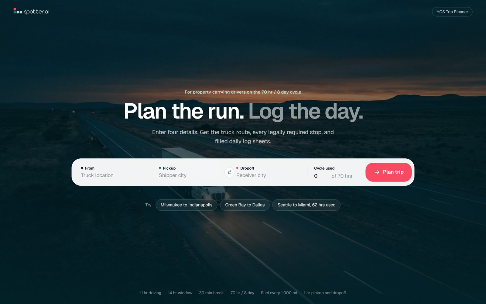

# Spotter HOS Trip Planner

Plans a US truck trip under the FMCSA hours of service rules and returns the route, required stops, turn by turn directions, and filled daily log sheets.

**Live:** https://stp-1.vercel.app



## Stack

Django 5.2, React 19, TypeScript, Vite, Tailwind, Leaflet, OpenRouteService. Deployed as one Vercel project.

US town data from [GeoNames](https://www.geonames.org) (CC BY 4.0) resolves city names locally, so a typical trip spends one routing call.

## Planning rules

Property carrier on the 70 hr / 8 day cycle, no adverse driving conditions.

- 11 hr driving limit, 14 hr window, 30 min break after 8 hrs of driving
- 10 hr sleeper berth reset, 34 hr restart when the cycle runs out
- Fuel stop at least every 1,000 mi, 1 hr for pickup and dropoff
- 30 min pretrip inspection each duty day, 55 mph average
- Times use the home terminal clock, starting 06:00 after a full rest

## Run locally

```bash
cp .env.example .env
uv sync
uv run --env-file .env python backend/manage.py runserver 8000
cd frontend && npm ci && npm run dev
```

## Test

```bash
uv run --env-file .env python backend/manage.py test trips
uv run ruff check
cd frontend && npm run build
```

## Deploy

Import the repository in Vercel and set `ORS_API_KEY` and `DJANGO_SECRET_KEY`.
